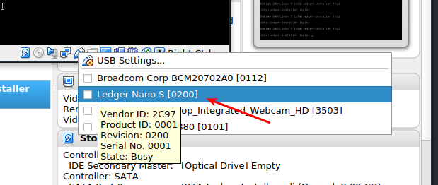

# Intro

You're about to install the IOTA beta app on the Ledger Nano S using our beta installer.

See [blue-app-iota GitHub repository](https://github.com/IOTA-Ledger/blue-app-iota) for the original source code.

See [Ledger's documentation](http://ledger.readthedocs.io) to get more info about the inner workings.

While we've made it as easy as possible to install the IOTA application, it still requests some technical know-how, so be patient and read along!

## IMPORTANT!

Before getting started, please be sure you've [read the warnings](https://github.com/IOTA-Ledger/blue-app-iota/blob/master/README.md#iota-security-concerns-on-ledger-nano-s)

## Requirements

Make sure that your Ledger Nano S is running firmware 1.4.2.<br>
For update instructions see: [How to update my Ledger Nano S with the firmware 1.4](https://support.ledgerwallet.com/hc/en-us/articles/360001340473-How-to-update-my-Ledger-Nano-S-with-the-firmware-1-4)

## Installation of VirtualBox

We are using VirtualBox (a virtual computer running in your own operating system) along with a prebuild 'image' (also known as a VM) of an operating system that has everything you need to install IOTA on the Ledger. This makes sure that no matter what you run (Windows, Mac, Linux etc) installation is guaranteed to work.

The application is free and opensource.

- Download VirtualBox here: https://www.virtualbox.org
- Now install it according to the steps given for your OS.

## Download the IOTA VM Installer Image

You can download the latest version of the IOTA VM Installer Image here: [Releases](https://github.com/IOTA-Ledger/blue-app-iota-loader-alpine/releases) (Download IOTA-Ledger-App-Loader.ova)

- Open VirtualBox
- In VirtualBox, click "File" > "Import Appliance"
- Browse to IOTA-Ledger-App-Loader.ova
- Click "Next"
- Click "Import"
   
## Installation on the Ledger Nano S

- Plug in your Ledger Nano S and enter your pin (you can leave it at the dashboard)
- Open VirtualBox
- Now select the new VM in the list on the left
- Click "Start"
- In VirtualBox, click the little USB icon on the bottom right and select the Ledger from the menu. This allows the VM to access the Ledger.<br>

- Wait until the VM starts downloading the app

During installation you are asked to insert your pin and asked to install an unofficial Ledger-application. Enter your pin and accept the warning by Ledger (the reasons for this warning is because our application is not released on the Ledger-store yet).

After the installation is done, you should see your IOTA app on the dashboard!

## Congratulations!

If it worked! Otherwise, feel free to head to issues and ask for help.

You can now continue to use the Ledger Nano S with a supported wallet app.

## Contributing

### Donations
Would you like to donate to help the development team? Send some IOTA to the following address:
```
ADLJXS9SKYQKMVQFXR9JDUUJHJWGDNWHQZMDGJFGZOX9BZEKDSXBSPZTTWEYPTNM9OZMYDQWZXFHRTXRCOITXAGCJZ
```
Please know that the donations made to this address will be shared with everyone who contributes (the contributions has to be worth something, of course)

### As a developer
Would you like to contribute as a dev? Please check out our [Discord channel](https://discord.gg/U3qRjZj) to contact us!
